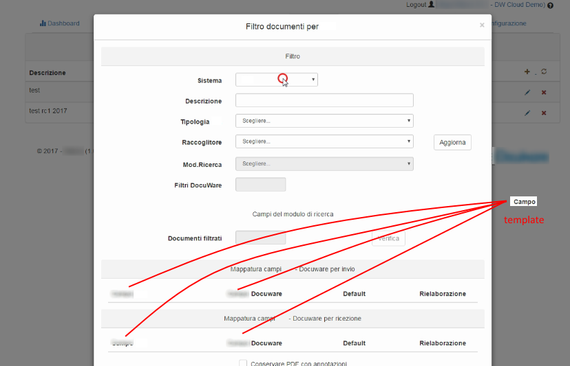

# Blur repetitive video parts
Blur parts of a video starting from template images

Since no professional or open source video editor allows us to mask repetitive parts that appear and disappear in one or more frames of a video, I created this utility for one of my CV videos.

## Usage 

Create a **./template** directory and put previously cutted parts to blur.

Then **run**:

​	`python    video_blur.py    source_video   target_video.mp4`

From **test.py**:

## Notes

- the algorithm uses a 30% tolerance
- transparent pictures doesn't work, so a same text with different background need different cuts
- sometimes the tollerance of 30% is too high, but 20% is insufficient

